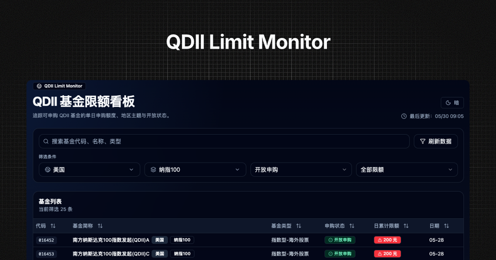

# QDII Limit Monitor



QDII Limit Monitor 是一个用于查看 QDII 基金申购状态与日累计申购限额的轻量看板。

项目基于东方财富基金公开接口获取基金申购状态数据，在服务端完成数据拉取、解析、标准化和 QDII 筛选，前端提供地区、主题、申购状态、限额等维度的快速筛选与排序。

## 功能特性

- 查看 QDII / 海外基金的申购状态与日累计申购限额。
- 默认展示美国地区、纳指 100 主题、开放申购的基金。
- 支持按基金代码、基金简称、基金类型搜索。
- 支持国家 / 地区多选筛选。
- 支持主题多选筛选，并与地区联动：
  - 选择地区后，主题下拉仅展示该地区实际存在的主题。
  - 当前已选主题如果在新地区中不存在，会自动剔除。
  - 如果已选主题全部不可用，会自动切回全部主题。
- 支持申购状态筛选：开放申购、暂停申购。
- 支持限额筛选：低限额、中限额、高限额、无限额。
- 表格默认按日累计限额从高到低排序。
- 点击基金代码或基金名称可打开东方财富基金详情页。
- 支持明暗主题切换。
- 服务端 API 响应带 CDN 缓存策略，适合部署到 Vercel。

## 数据口径说明

数据源来自东方财富基金接口：

```text
https://fund.eastmoney.com/Data/Fund_JJJZ_Data.aspx
```

项目会请求全量基金申购状态数据，然后在服务端本地筛选和标准化。

当前 QDII 入选口径采用较严格的官方信号：

- 基金类型包含 `QDII`。
- 或基金类型包含 `海外`。
- 或基金简称包含 `QDII`。

主题关键词只用于对已入选基金进行分类展示，不再用于决定基金是否进入 QDII 清单。

## 申购状态与限额规则

为了降低理解成本，前端只展示两种申购状态：

- 开放申购
- 暂停申购

当日累计限额为 0，或日累计限额小于最低申购金额时，会归一化为“暂停申购”。

限额展示用于辅助判断额度紧张程度：

- 低限额
- 中限额
- 高限额
- 无限额

## 地区与主题

项目会为每只入选基金计算两个分类字段：

- 国家 / 地区：回答“主要投向哪里”。
- 主题：回答“主要投向什么”。

地区与主题筛选支持联动：选择地区后，主题下拉只显示所选地区实际存在的主题。

## 技术栈

- Next.js App Router
- React
- TypeScript
- Tailwind CSS
- TanStack Table
- Radix UI
- lucide-react
- next-themes
- sonner

## 本地开发

安装依赖：

```bash
pnpm install
```

启动开发服务器：

```bash
pnpm dev
```

构建生产版本：

```bash
pnpm build
```

启动生产服务：

```bash
pnpm start
```

## 项目结构

```text
app/
  api/funds/route.ts        服务端基金数据接口
  globals.css               全局样式与主题变量
  layout.tsx                应用布局
  page.tsx                  首页入口
components/
  fund-dashboard.tsx        看板主界面
  fund-toolbar.tsx          搜索与筛选工具栏
  fund-table.tsx            基金表格
  fund-status-badge.tsx     申购状态徽章
  limit-badge.tsx           限额徽章
  theme-toggle.tsx          明暗主题切换
lib/
  eastmoney.ts              东方财富接口请求与响应构建
  fund-filters.ts           QDII、地区、主题、交易形态分类规则
  fund-format.ts            金额、状态、时间格式化
  fund-normalizer.ts        原始基金记录标准化
  types.ts                  类型定义
```

## 服务端缓存

`/api/funds` 会在服务端拉取东方财富全量数据，过滤并返回应用所需的 QDII 数据。

响应头使用：

```text
Cache-Control: s-maxage=21600, stale-while-revalidate=43200
```

含义：

- CDN 可缓存 6 小时。
- 过期后可在 12 小时内使用 stale 数据并后台更新。

这样可以减少部署到 Vercel 后对上游接口的频繁访问。

## 部署

推荐部署到 Vercel。

部署前确认可以正常构建：

```bash
pnpm build
```

## 注意事项

- 本项目仅用于信息展示与个人研究，不构成投资建议。
- 上游数据字段和接口行为可能变化，若出现异常需要同步调整解析逻辑。
- QDII 入选与主题分类基于公开字段和关键词规则，可能存在边界情况。
