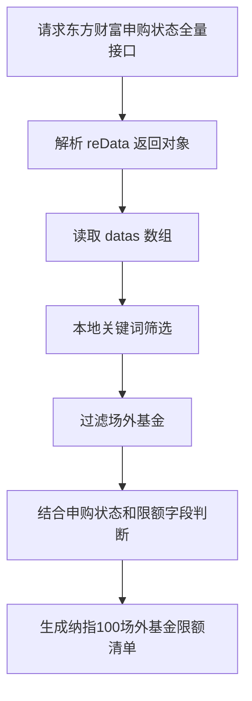

# 东方财富基金申购状态接口说明

## 1. 接口概览

东方财富基金申购状态列表接口：

```text
https://fund.eastmoney.com/Data/Fund_JJJZ_Data.aspx?t=8&page=1,50000&js=reData&sort=fcode,asc
```

该接口主要用于获取基金申购、赎回状态及申购限额等信息。根据现有探索结果，该接口更接近于一个全量列表接口，主要支持分页和排序，不支持可靠的服务端关键词筛选。

典型用途：

- 拉取基金申购状态全量数据
- 查看基金申购状态、赎回状态、购买起点、日累计限定金额
- 按基金代码、限额、申购状态等字段排序
- 在本地按基金名称、基金类型、基金代码、关键词进行二次筛选

---

## 2. 请求方式

### 2.1 请求 URL

```text
https://fund.eastmoney.com/Data/Fund_JJJZ_Data.aspx
```

### 2.2 请求方法

通常使用 GET 请求。

### 2.3 示例请求

按基金代码升序拉取大量数据：

```text
https://fund.eastmoney.com/Data/Fund_JJJZ_Data.aspx?t=8&page=1,50000&js=reData&sort=fcode,asc
```

按日累计限定金额升序拉取前 50 条数据：

```text
https://fund.eastmoney.com/Data/Fund_JJJZ_Data.aspx?t=8&page=1,50&js=reData&sort=maxsg,asc
```

---

## 3. 请求参数说明

| 参数名 | 示例值 | 含义 | 备注 |
|---|---:|---|---|
| t | 8 | 数据类型或列表类型 | 当前申购状态列表使用 t=8 |
| page | 1,50 | 页码和每页条数 | 格式为 页码,每页条数，例如 1,50 或 1,50000 |
| js | reData | 返回 JavaScript 变量名 | 返回内容会包装为 reData=... 形式 |
| sort | fcode,asc | 排序字段和排序方向 | 支持部分字段排序，例如 fcode,asc、maxsg,asc |

### 3.1 page 参数

`page` 参数由两部分组成：

```text
page=页码,每页条数
```

示例：

```text
page=1,50
page=1,50000
```

如果目标是本地筛选，建议尽量一次性拉取较大的每页条数，例如：

```text
page=1,50000
```

本次实测观察到的全量记录数为：

```text
record: 26634
```

因此 `page=1,50000` 可以覆盖当前实测全量数据，但后续如果记录数增长，仍建议根据返回的 `record` 和 `pages` 做分页兜底。

---

## 4. 排序能力

该接口支持排序，但排序不是筛选。

已验证有效的排序字段如下。其中 `fcode` 和 `maxsg` 已在本次实测中再次确认有效：

| 排序字段 | 含义 | 示例 |
|---|---|---|
| fcode | 基金代码 | sort=fcode,asc |
| maxsg | 日累计限定金额 | sort=maxsg,asc |
| sgzt | 申购状态 | sort=sgzt,asc |
| shzt | 赎回状态 | sort=shzt,asc |
| minsg | 购买起点 | sort=minsg,asc |

### 4.1 按基金代码升序

```text
https://fund.eastmoney.com/Data/Fund_JJJZ_Data.aspx?t=8&page=1,50&js=reData&sort=fcode,asc
```

### 4.2 按日累计限定金额升序

```text
https://fund.eastmoney.com/Data/Fund_JJJZ_Data.aspx?t=8&page=1,50&js=reData&sort=maxsg,asc
```

### 4.3 排序方向

常见排序方向：

| 方向 | 含义 |
|---|---|
| asc | 升序 |
| desc | 降序 |

---

## 5. 服务端筛选能力结论

根据探索结果，该接口基本没有可用的关键词筛选能力。

以下疑似筛选参数已测试，但返回数据未发生变化：

```text
keyword=纳斯达克
key=纳斯达克
keywords=纳斯达克
search=纳斯达克
q=纳斯达克
wd=纳斯达克
fund=纳斯达克
fundcode=000834
fcode=000834
code=000834
name=纳斯达克
fname=纳斯达克
ftype=QDII
type=QDII
sgzt=限大额
status=限大额
filter=纳斯达克
```

测试现象：

- 本次组合测试中 `record` 仍为 26634
- 第一页仍然从 `000001 华夏成长混合` 开始
- 返回内容没有因为关键词、基金代码、基金类型或状态参数而缩小范围

结论：

> 该接口不像一个支持服务端搜索或服务端过滤的接口，更像是后端返回申购状态全表，前端负责分页、排序、展示，业务筛选需要在本地完成。

---

## 6. 返回格式说明

接口返回通常是 JavaScript 变量赋值形式，而不是纯 JSON。

示意：

```javascript
reData={
  datas: [...],
  record: "26634",
  pages: "5327",
  curpage: "1",
  showday: ["2026-05-29", "2026-05-28"]
}
```

实际字段名可能随接口版本变化，解析时应以实际返回为准。

由于 `js=reData` 会让接口返回 `reData=...` 形式，解析流程通常是：

1. 发起 GET 请求获取文本
2. 去掉前缀 `reData=` 或使用正则提取对象内容
3. 将对象文本转换为 JSON 结构
4. 读取 `datas` 数组

---

## 7. datas 字段结构

`datas` 中每条记录是一个数组，字段位置含义大致如下：

| 下标 | 字段 | 含义 | 示例 |
|---:|---|---|---|
| 0 | fcode | 基金代码 | 000834 |
| 1 | fname | 基金简称 | 大成纳斯达克100ETF联接(QDII)A |
| 2 | ftype | 基金类型 | 指数型-海外股票 |
| 3 | nav | 最新净值或万份收益 | ... |
| 4 | date | 日期 | 05-27 |
| 5 | sgzt | 申购状态 | 限大额 |
| 6 | shzt | 赎回状态 | 开放赎回 |
| 7 | nextOpenDate | 下一开放日 | 空字符串 |
| 8 | minsg | 购买起点 | 10.0 |
| 9 | maxsg | 日累计限定金额 | 50.0 |
| 10 | feeRaw | 手续费原始值 | 1.0 |
| 11 | buyStatusCode | 购买状态代码 | 1 |
| 12 | feeDisplay | 手续费展示 | 0.12% |

### 7.1 示例记录

```json
[
  "000834",
  "大成纳斯达克100ETF联接(QDII)A",
  "指数型-海外股票",
  "...",
  "05-27",
  "限大额",
  "开放赎回",
  "",
  "10.0",
  "50.0",
  "1.0",
  "1",
  "0.12%"
]
```

### 7.2 基金类型字段与 QDII 判断

接口里有“基金类型”字段，但它不是具名 JSON 字段，而是 `datas` 每条数组记录的第 2 下标位置，即 `datas[i][2]`。

示例 1：

```json
["000041","华夏全球股票(QDII)(人民币)","QDII-普通股票","1.5308","05-28","限大额","开放赎回","","10.0","10000.0","1.0","1","0.16%"]
```

该记录中：

| 下标 | 值 | 含义 |
|---:|---|---|
| 0 | 000041 | 基金代码 |
| 1 | 华夏全球股票(QDII)(人民币) | 基金简称 |
| 2 | QDII-普通股票 | 基金类型 |

示例 2：

```json
["000055","广发纳斯达克100ETF联接美元(QDII)A","指数型-海外股票","1.2423","05-28","限大额","开放赎回","","1.0","0","0","","1.30%"]
```

该记录中：

| 下标 | 值 | 含义 |
|---:|---|---|
| 0 | 000055 | 基金代码 |
| 1 | 广发纳斯达克100ETF联接美元(QDII)A | 基金简称 |
| 2 | 指数型-海外股票 | 基金类型 |

因此，QDII 或海外基金判断不能只依赖 `datas[i][2]` 是否以 `QDII` 开头。部分 QDII 或海外联接基金的基金类型会显示为 `指数型-海外股票`，而不是 `QDII-普通股票`。

更稳妥的本地判断规则是同时结合：

- `datas[i][1]` 基金简称是否包含 `QDII`、`纳斯达克`、`纳指`、`NASDAQ`、`恒生`、`标普`、`美国`、`全球`、`境外` 等关键词。
- `datas[i][2]` 基金类型是否包含 `QDII` 或 `海外`。

对“纳指 100 场外基金限额”这个场景，推荐优先使用基金简称关键词识别纳指主题，再用基金类型字段确认其是否属于海外股票或 QDII 相关类别。

---

## 8. 日累计限定金额说明

第 9 个字段，即下标 `9`，表示日累计限定金额，通常是原始数字字符串。

常见含义：

| 原始值 | 含义 |
|---:|---|
| 50.0 | 50 元 |
| 100.0 | 100 元 |
| 10000.0 | 1 万元 |
| 100000000000 | 通常可视为无限额或极高限额 |
| 0 | 需要结合申购状态判断，可能代表暂停、不可正常申购或特殊份额 |
| 0.01 | 需要结合申购状态判断，可能代表美元份额、特殊限制或不可正常申购 |

注意：

- 不能只看 `maxsg` 判断是否可买。
- 应结合 `sgzt` 申购状态一起判断。
- 对 QDII、美元份额、特殊基金份额，`0`、`0.01` 等值需要单独处理。

---

## 9. 申购状态说明

第 5 个字段，即下标 `5`，表示申购状态。

常见值可能包括：

| 状态 | 含义 |
|---|---|
| 开放申购 | 当前允许申购 |
| 限大额 | 当前允许申购，但存在单日累计限额 |
| 暂停申购 | 当前不允许申购 |
| 暂停大额申购 | 当前可能允许小额申购，但限制大额申购 |

实际状态值应以接口返回为准。

---

## 10. 适合本地筛选的业务流程

由于服务端筛选参数不可用，如果要统一查看“纳指 100 场外基金限额”，建议使用以下流程：



推荐筛选逻辑：

1. 拉取全量接口：`page=1,50000`
2. 本地按基金简称筛选关键词：
   - 纳斯达克
   - 纳指
   - NASDAQ
   - Nasdaq
   - NASDAQ100
   - 纳斯达克100
3. 本地按基金类型筛选。注意基金类型不是具名 JSON key，而是 `datas[i][2]`：
   - QDII
   - 海外
   - 海外股票
   - 指数型-海外股票
4. 排除明显不是场外联接或普通开放式基金的品种，例如：
   - ETF 场内主代码
   - LOF 场内交易倾向较强的条目，是否排除需按业务口径确认
5. 保留或重点关注申购状态：
   - 限大额
   - 暂停大额申购
   - 开放申购
6. 输出字段建议包括：
   - 基金代码
   - 基金简称
   - 基金类型
   - 日期
   - 申购状态
   - 赎回状态
   - 购买起点
   - 日累计限定金额
   - 手续费展示

---

## 11. 针对纳指 100 场外基金限额的建议判定规则

### 11.1 关键词命中

基金简称建议命中以下任一关键词：

```text
纳斯达克
纳指
NASDAQ
Nasdaq
纳斯达克100
NASDAQ100
Nasdaq100
```

### 11.2 场外基金识别

优先保留名称包含以下特征的基金：

```text
联接
ETF联接
QDII
A
C
人民币
```

谨慎处理或按业务规则排除：

```text
ETF
LOF
美元
```

说明：

- 名称包含 `ETF联接` 的通常是场外联接基金，不应因为包含 `ETF` 就直接排除。
- 名称只有 `ETF` 且没有 `联接` 的更可能是场内基金。
- 美元份额可能存在特殊申购限额和状态，不建议与人民币份额直接合并比较。

### 11.3 限额展示

建议将原始 `maxsg` 数值转换为更易读的展示值：

| 原始值范围 | 展示建议 |
|---:|---|
| 小于 10000 | 显示为 N 元 |
| 大于等于 10000 且小于 100000000 | 显示为 N 万元 |
| 大于等于 100000000 | 显示为无限额或极高限额 |
| 0 或 0.01 | 显示为需结合状态判断 |

---

## 12. 风险和注意事项

1. 接口不是官方稳定开放 API，字段和返回结构可能变化。
2. 该接口返回的是列表数据，不能假设所有字段都始终存在。
3. 服务端筛选参数目前未观察到有效支持，应避免依赖。
4. `page=1,50000` 当前可覆盖全量，但未来记录数增长时应根据 `record` 和 `pages` 做分页兜底。
5. `maxsg` 不能脱离 `sgzt` 单独使用。
6. 对 QDII、美元份额、暂停申购、大额限制等情况，需要额外业务规则。
7. 基金名称里的 `ETF` 不等于场内基金，`ETF联接` 通常仍属于场外联接基金。
8. 接口有基金类型信息，但位于 `datas[i][2]` 数组位置，不是具名字段；判断 QDII 时应结合 `datas[i][1]` 基金简称和 `datas[i][2]` 基金类型。

---

## 13. 本次实测验证记录

### 13.1 基础返回结构验证

实测请求：

```text
https://fund.eastmoney.com/Data/Fund_JJJZ_Data.aspx?t=8&page=1,5&js=reData&sort=fcode,asc
```

实测结果摘要：

```text
record: "26634"
pages: "5327"
curpage: "1"
showday: ["2026-05-29", "2026-05-28"]
```

第一页前 5 条数据从以下基金开始：

| 顺序 | 基金代码 | 基金简称 | 申购状态 | 赎回状态 | 日累计限定金额 |
|---:|---|---|---|---|---:|
| 1 | 000001 | 华夏成长混合 | 开放申购 | 开放赎回 | 100000000000 |
| 2 | 000003 | 中海可转债债券A | 开放申购 | 开放赎回 | 10000000000 |
| 3 | 000004 | 中海可转债债券C | 开放申购 | 开放赎回 | 10000000000 |
| 4 | 000005 | 嘉实增强信用定期债券 | 暂停申购 | 暂停赎回 | 100000000000 |
| 5 | 000006 | 西部利得量化成长混合A | 开放申购 | 开放赎回 | 100000000000 |

验证结论：

- 返回内容是 `var reData={...}` 形式。
- 核心数据位于 `datas` 数组。
- `record`、`pages`、`curpage`、`showday` 字段存在。
- 每条 `datas` 记录仍为 13 个字段的数组结构。

### 13.2 maxsg 排序验证

实测请求：

```text
https://fund.eastmoney.com/Data/Fund_JJJZ_Data.aspx?t=8&page=1,10&js=reData&sort=maxsg,asc
```

实测结果摘要：

- 第一页返回的 `maxsg` 均为 `0.01`。
- 对应基金多数为暂停申购、暂停赎回的定开债 C 类份额。
- `record` 为 `26634`，`pages` 为 `2664`，符合每页 10 条时的分页规模。

验证结论：

> `sort=maxsg,asc` 当前有效，可以按日累计限定金额升序排序，但排序结果不能替代业务筛选。

### 13.3 疑似筛选参数验证

实测请求在基础 URL 上同时追加以下参数：

```text
keyword=纳斯达克
fundcode=000834
fcode=000834
type=QDII
sgzt=限大额
```

实测 URL：

```text
https://fund.eastmoney.com/Data/Fund_JJJZ_Data.aspx?t=8&page=1,5&js=reData&sort=fcode,asc&keyword=%E7%BA%B3%E6%96%AF%E8%BE%BE%E5%85%8B&fundcode=000834&fcode=000834&type=QDII&sgzt=%E9%99%90%E5%A4%A7%E9%A2%9D
```

实测结果摘要：

- `record` 仍为 `26634`。
- `pages` 仍为 `5327`。
- 第一页仍从 `000001 华夏成长混合` 开始。
- 返回的前 5 条数据与未追加筛选参数时一致。

验证结论：

> 当前这些参数不会触发服务端筛选，不能依赖它们做关键词、基金代码、基金类型或申购状态过滤。

---

## 14. 推荐实现方案摘要

推荐实现策略：

```text
拉全量接口 -> 解析 datas -> 本地关键词筛选 -> 本地场外规则过滤 -> 格式化限额 -> 输出结果
```

最小可用请求：

```text
https://fund.eastmoney.com/Data/Fund_JJJZ_Data.aspx?t=8&page=1,50000&js=reData&sort=fcode,asc
```

推荐输出字段：

| 字段 | 来源下标 |
|---|---:|
| 基金代码 | 0 |
| 基金简称 | 1 |
| 基金类型 | 2 |
| 日期 | 4 |
| 申购状态 | 5 |
| 赎回状态 | 6 |
| 购买起点 | 8 |
| 日累计限定金额 | 9 |
| 手续费展示 | 12 |

最终结论：

> 东方财富该接口适合作为申购状态全量数据源，不适合作为服务端搜索接口。本次实测再次确认：关键词、基金代码、基金类型和申购状态等疑似筛选参数不会改变返回集合。接口有基金类型信息，但位于 `datas[i][2]` 数组位置；判断 QDII 或海外基金时应结合 `datas[i][1]` 基金简称与 `datas[i][2]` 基金类型。纳指 100 场外基金限额查询应采用全量拉取后本地筛选的方式实现。
