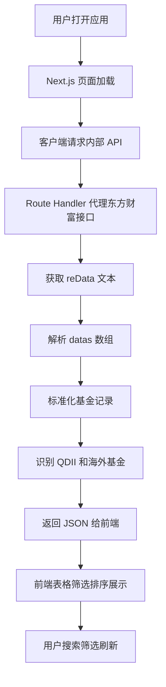
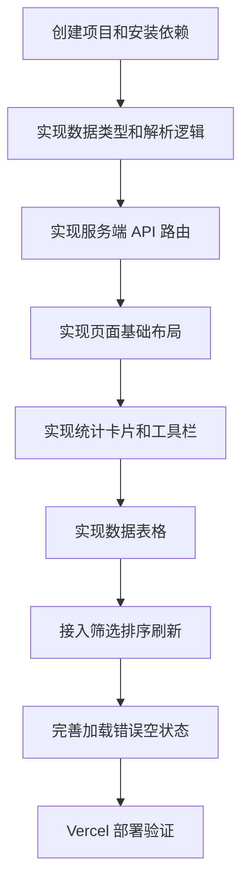

# QDII 基金限额查看应用设计方案

## 1. 产品目标

构建一个部署在 Vercel 上的 Next.js 应用，用于快速查看 QDII 和海外基金的申购限额情况。

核心定位：

- 纯前端体验为主，首屏即展示可用数据
- 使用 Next.js 服务端 API 路由代理东方财富接口，避免浏览器跨域和解析非标准 JSON 的问题
- 使用 shadcn/ui 构建清爽的数据看板和表格体验
- 使用 lucide-react 提供轻量图标表达
- 默认展示 QDII 和海外基金限额
- 支持搜索、排序、筛选、手动刷新
- 适合部署到 Vercel

---

## 2. 技术栈

| 类别 | 选型 | 用途 |
|---|---|---|
| 框架 | Next.js App Router | 页面、服务端 API 路由、部署 Vercel |
| 语言 | TypeScript | 类型安全和数据模型约束 |
| 样式 | Tailwind CSS | 原子化样式 |
| UI | shadcn/ui | Button、Input、Card、Badge、Table、Select、Skeleton、Tooltip、Alert |
| 图标 | lucide-react | Search、RefreshCw、Filter、Globe2、AlertTriangle、TrendingUp 等 |
| 表格 | @tanstack/react-table | 客户端排序、过滤、分页 |
| 通知 | sonner | 刷新成功、刷新失败、接口异常提示 |

---

## 3. 总体架构



---

## 4. 推荐目录结构

```text
app/
  page.tsx
  api/
    funds/
      route.ts
components/
  fund-dashboard.tsx
  fund-toolbar.tsx
  fund-table.tsx
  fund-stat-cards.tsx
  fund-status-badge.tsx
  limit-badge.tsx
  refresh-button.tsx
components/ui/
  shadcn 组件
lib/
  eastmoney.ts
  fund-normalizer.ts
  fund-filters.ts
  fund-format.ts
  types.ts
plans/
  eastmoney_fund_jjjz_api.md
  qdii_limit_nextjs_app_design.md
```

### 4.1 关键文件职责

| 文件 | 职责 |
|---|---|
| app/page.tsx | 页面入口，组合仪表盘组件 |
| app/api/funds/route.ts | 服务端 API 路由，代理东方财富接口并返回标准 JSON |
| lib/eastmoney.ts | 请求东方财富接口、解析 reData 文本 |
| lib/fund-normalizer.ts | 将 datas 数组映射为类型化对象 |
| lib/fund-filters.ts | QDII/海外基金识别、默认过滤规则 |
| lib/fund-format.ts | 金额格式化、状态格式化、排序辅助函数 |
| lib/types.ts | FundRecord、FundApiResponse 等类型定义 |
| components/fund-dashboard.tsx | 主看板容器，负责数据获取和交互状态 |
| components/fund-toolbar.tsx | 搜索框、状态筛选、类型筛选、刷新按钮 |
| components/fund-table.tsx | 基金限额数据表 |
| components/fund-stat-cards.tsx | 统计卡片，如总数、限大额数、暂停数、低限额数 |

---

## 5. 数据流设计

### 5.1 服务端 API 路由

内部接口：

```text
GET /api/funds
```

推荐查询参数：

| 参数 | 示例 | 含义 |
|---|---|---|
| refresh | 1 | 手动刷新时跳过缓存或使用 no-store |
| scope | qdii | 默认只返回 QDII/海外基金 |
| sort | fcode,asc | 转发给东方财富接口的排序参数 |

服务端逻辑：

1. 请求东方财富接口：
   ```text
   https://fund.eastmoney.com/Data/Fund_JJJZ_Data.aspx?t=8&page=1,50000&js=reData&sort=fcode,asc
   ```
2. 获取返回文本。
3. 去掉 `var reData=` 或 `reData=` 前缀。
4. 将非标准对象文本解析为可用结构。
5. 读取 `datas`。
6. 映射为标准对象。
7. 默认过滤 QDII/海外基金。
8. 返回 JSON。

### 5.2 Vercel 缓存策略

推荐采用“短缓存 + 手动刷新”的策略：

- 默认请求：服务端 fetch 使用 `next: { revalidate: 300 }`，缓存约 5 分钟。
- 手动刷新：前端请求 `/api/funds?refresh=1`，服务端 fetch 使用 `cache: 'no-store'`。
- API 响应中返回 `fetchedAt`，前端显示最后更新时间。

这样可以兼顾：

- Vercel 部署稳定性
- 东方财富接口访问压力控制
- 用户手动刷新体验

---

## 6. 标准化数据模型

前端和服务端统一使用对象结构，而不是直接使用数组下标。

```ts
export type FundRecord = {
  code: string
  name: string
  type: string
  nav: string
  date: string
  subscribeStatus: string
  redeemStatus: string
  nextOpenDate: string
  minSubscribeAmount: number | null
  maxSubscribeAmount: number | null
  rawFee: string
  buyStatusCode: string
  feeText: string
  isQdiiLike: boolean
  isOverseasLike: boolean
  isNasdaqLike: boolean
  limitLevel: 'none' | 'low' | 'medium' | 'high' | 'unknown' | 'paused'
  formattedLimit: string
}
```

原始数组映射：

| 原始下标 | 标准字段 | 含义 |
|---:|---|---|
| 0 | code | 基金代码 |
| 1 | name | 基金简称 |
| 2 | type | 基金类型 |
| 3 | nav | 最新净值或万份收益 |
| 4 | date | 日期 |
| 5 | subscribeStatus | 申购状态 |
| 6 | redeemStatus | 赎回状态 |
| 7 | nextOpenDate | 下一开放日 |
| 8 | minSubscribeAmount | 购买起点 |
| 9 | maxSubscribeAmount | 日累计限定金额 |
| 10 | rawFee | 手续费原始值 |
| 11 | buyStatusCode | 购买状态代码 |
| 12 | feeText | 手续费展示 |

---

## 7. QDII 和海外基金识别规则

由于接口没有独立 QDII 标识字段，需结合基金简称和基金类型。

### 7.1 基金类型字段

基金类型存在于：

```text
datas[i][2]
```

但它不是具名 JSON key。

可能值：

```text
QDII-普通股票
QDII-纯债
指数型-海外股票
```

### 7.2 默认 QDII/海外识别

满足任一条件即可纳入默认展示：

- 基金类型包含 `QDII`
- 基金类型包含 `海外`
- 基金简称包含 `QDII`
- 基金简称包含典型海外市场关键词：
  - 纳斯达克
  - 纳指
  - NASDAQ
  - Nasdaq
  - 标普
  - 美国
  - 全球
  - 境外
  - 恒生
  - 香港

### 7.3 纳指 100 识别

纳指相关基金单独标记 `isNasdaqLike`：

- 基金简称包含 `纳斯达克`
- 基金简称包含 `纳指`
- 基金简称包含 `NASDAQ`
- 基金简称包含 `Nasdaq`
- 基金简称包含 `纳斯达克100`
- 基金简称包含 `NASDAQ100`

### 7.4 场外倾向识别

优先保留：

- 名称包含 `联接`
- 名称包含 `ETF联接`
- 名称包含 `A`
- 名称包含 `C`
- 名称包含 `人民币`

谨慎处理：

- 名称只有 `ETF` 且没有 `联接`，可能更偏场内
- 名称包含 `美元`、`现汇`、`现钞`，应单独展示或打标签

---

## 8. 限额格式化与等级

### 8.1 格式化规则

| 原始 maxSubscribeAmount | 展示 |
|---:|---|
| null | 未知 |
| 0 | 需结合状态判断 |
| 0.01 | 需结合状态判断 |
| 小于 10000 | N 元 |
| 大于等于 10000 且小于 100000000 | N 万元 |
| 大于等于 100000000 | 无限额或极高限额 |

### 8.2 限额等级

| 等级 | 条件 | UI 表达 |
|---|---|---|
| paused | 申购状态包含暂停 | 灰色 Badge |
| low | 限额小于等于 1000 | 红色 Badge |
| medium | 限额大于 1000 且小于等于 10000 | 橙色 Badge |
| high | 限额大于 10000 且小于 100000000 | 蓝色 Badge |
| none | 限额大于等于 100000000 且开放申购 | 绿色 Badge |
| unknown | 0、0.01 或无法解析 | 次要 Badge |

---

## 9. 页面交互设计

### 9.1 页面结构

1. 顶部标题区
   - 标题：QDII 基金限额看板
   - 描述：基于东方财富申购状态接口，默认展示 QDII 和海外基金
   - 右侧：刷新按钮、最后更新时间

2. 统计卡片区
   - QDII/海外基金总数
   - 限大额基金数
   - 暂停申购基金数
   - 纳指相关基金数

3. 筛选工具栏
   - 搜索框：代码、名称、类型
   - 申购状态筛选：全部、开放申购、限大额、暂停申购
   - 主题筛选：全部海外、纳指、恒生、美国、全球
   - 份额筛选：全部、人民币、美元、联接
   - 限额筛选：全部、低限额、中限额、高限额、无限额、未知

4. 数据表格
   - 基金代码
   - 基金简称
   - 基金类型
   - 申购状态
   - 日累计限额
   - 购买起点
   - 净值日期
   - 手续费

5. 空状态和错误状态
   - 无匹配结果时显示 Empty 状态
   - 接口异常时显示 Alert 和重试按钮

### 9.2 表格排序

推荐默认排序：

1. 限大额和暂停申购优先
2. 限额从低到高
3. 基金代码升序

用户可点击表头排序：

- 基金代码
- 基金名称
- 基金类型
- 申购状态
- 日累计限额
- 日期

---

## 10. shadcn/ui 组件选择

| 场景 | 组件 |
|---|---|
| 页面容器 | Card |
| 操作按钮 | Button |
| 搜索输入 | Input |
| 状态筛选 | Select |
| 多条件标签 | Badge |
| 数据展示 | Table |
| 表格分页 | Button 或 Pagination |
| 加载态 | Skeleton |
| 错误提示 | Alert |
| 刷新反馈 | sonner |
| 说明提示 | Tooltip 或 HoverCard |
| 分割线 | Separator |

---

## 11. lucide-react 图标选择

| 场景 | 图标 |
|---|---|
| 应用标题 | Globe2 |
| 搜索框 | Search |
| 刷新按钮 | RefreshCw |
| 筛选器 | Filter |
| 限额提示 | Gauge |
| 低限额警示 | AlertTriangle |
| 开放申购 | CheckCircle2 |
| 暂停申购 | Ban |
| 趋势或统计 | TrendingUp |
| 更新时间 | Clock |
| 错误状态 | CircleAlert |

---

## 12. API 响应设计

```ts
export type FundsApiResponse = {
  ok: boolean
  source: 'eastmoney'
  fetchedAt: string
  total: number
  filteredTotal: number
  record: number
  showday: string[]
  funds: FundRecord[]
  error?: string
}
```

成功示例：

```json
{
  "ok": true,
  "source": "eastmoney",
  "fetchedAt": "2026-05-29T12:55:00.000Z",
  "total": 26634,
  "filteredTotal": 320,
  "record": 26634,
  "showday": ["2026-05-29", "2026-05-28"],
  "funds": []
}
```

失败示例：

```json
{
  "ok": false,
  "source": "eastmoney",
  "fetchedAt": "2026-05-29T12:55:00.000Z",
  "total": 0,
  "filteredTotal": 0,
  "record": 0,
  "showday": [],
  "funds": [],
  "error": "东方财富接口请求失败"
}
```

---

## 13. Vercel 部署注意事项

1. Route Handler 应使用 Node.js runtime，便于处理文本解析和外部请求。
2. 不需要数据库，首版可完全无状态。
3. 默认使用短缓存，避免每次页面交互都打东方财富接口。
4. 手动刷新通过 query 参数触发 no-store 请求。
5. 如果东方财富接口偶发失败，前端应显示错误提示，而不是白屏。
6. 如果未来访问量增大，可增加 Upstash Redis 或 Vercel KV 做缓存，但首版不需要。
7. 不建议在浏览器端直接请求东方财富接口，解析和跨域都应由服务端 API 路由处理。

---

## 14. 最小可用版本范围

首版建议只做以下功能：

- 服务端 API 路由代理东方财富接口
- 解析 `reData` 返回数据
- 标准化 13 个数组字段
- 默认过滤 QDII/海外基金
- 首页展示统计卡片
- 首页展示基金限额表格
- 搜索基金代码、名称、类型
- 按申购状态筛选
- 按主题筛选纳指相关基金
- 按限额等级筛选
- 表格排序
- 手动刷新
- 加载态、错误态、空状态
- Vercel 可部署

---

## 15. 后续增强方向

- 收藏关注基金
- 导出 CSV
- 限额变化历史
- 低限额推送提醒
- 多数据源交叉验证
- 基金详情抽屉
- 移动端卡片列表模式
- 自动识别人民币、美元、现汇、现钞份额

---

## 16. 实施 Todo

- [ ] 初始化 Next.js App Router TypeScript 项目
- [ ] 配置 Tailwind CSS、shadcn/ui、lucide-react
- [ ] 添加 shadcn/ui 基础组件：button、input、card、badge、table、select、skeleton、alert、separator、tooltip、sonner
- [ ] 创建 `lib/types.ts`，定义 `FundRecord` 和 `FundsApiResponse`
- [ ] 创建 `lib/eastmoney.ts`，实现东方财富接口请求与 `reData` 文本解析
- [ ] 创建 `lib/fund-normalizer.ts`，将 `datas` 数组映射为标准对象
- [ ] 创建 `lib/fund-filters.ts`，实现 QDII/海外、纳指、份额类型、申购状态、限额等级识别
- [ ] 创建 `lib/fund-format.ts`，实现限额金额格式化和状态样式映射
- [ ] 创建 `app/api/funds/route.ts`，实现服务端 API 路由、缓存策略和错误处理
- [ ] 创建 `components/fund-stat-cards.tsx`，展示统计卡片
- [ ] 创建 `components/fund-toolbar.tsx`，实现搜索、筛选和刷新入口
- [ ] 创建 `components/fund-table.tsx`，实现基金限额表格、排序和分页
- [ ] 创建 `components/fund-dashboard.tsx`，整合数据请求、状态管理、筛选逻辑和页面布局
- [ ] 更新 `app/page.tsx`，渲染 QDII 基金限额看板
- [ ] 处理 loading、empty、error 状态
- [ ] 本地验证 `/api/funds` 返回结构和页面交互
- [ ] 验证 Vercel 部署兼容性

---

## 17. 推荐实施顺序


